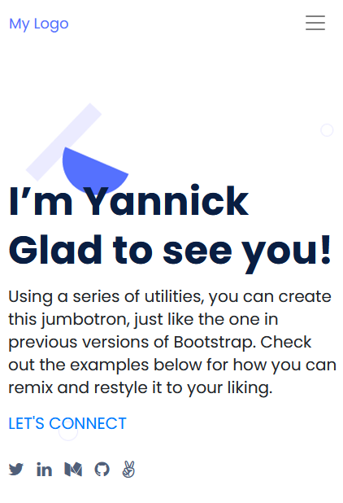
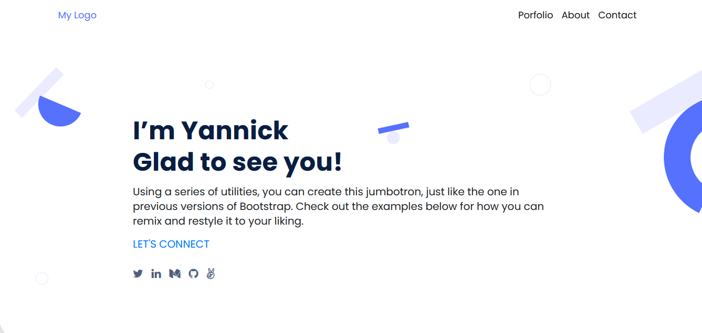

# Portfolio 

Project: Build my personal portfolio.
The project is inspired by the figma microverse template 1 (https://figma.com/)
It use to learn how parse a Figma design to create a UI, and use Flexbox to place elements in the page.

**Mobile Version**

 **Web version**

 

## Demo 

[Live Demo Link](https://portfoliocodecaiine.github.io/)
 
## Stacks

- git/github
- html/css
- linters (html - css )

## Get Started

- Clone this project on your local environment 
- Get your browser update 

## Authors

👤 **codecaiine**

- Full: Yannick-Noel AKA
- Location: Côte d'Ivoire
- GitHub: [@codecaiine](https://github.com/codecaiine)
- Twitter: [@yannicknaka](https://twitter.com/yannicknaka)
- LinkedIn: [LinkedIn](https://www.linkedin.com/in/yannick-no%C3%ABl-aka/)

## 🤝 Contributing

Contributions, issues, and feature requests are welcome!

Feel free to check the [issues page](../../issues/).

## Show your support

Give a ⭐️ if you like this project!

## Acknowledgments

- Thanks to Microverse to made it
- learning and coding partners

## 📝 License

This project is [MIT](./MIT.md) licensed.
